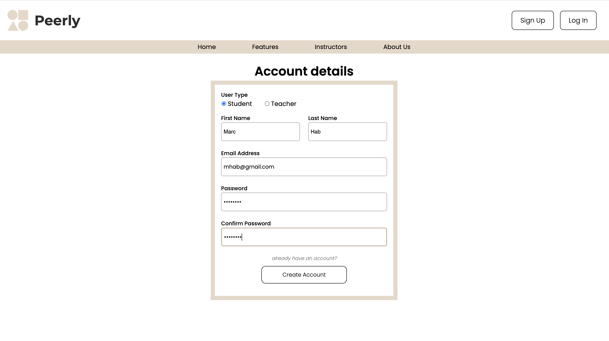
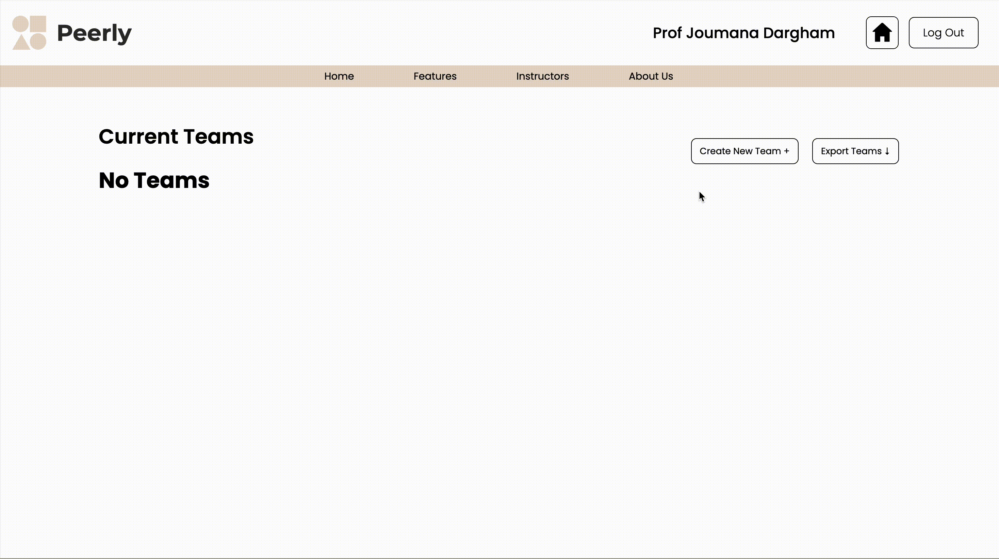

# Peerly – Peer Assessment Platform

> Empowering students and instructors with transparent, structured, and meaningful peer feedback.

## 🎯 Objective

Peerly is a web-based platform designed to simplify peer evaluations within student teams. It provides a space for honest, structured feedback while giving instructors visibility into team dynamics and individual contributions.

This project was developed as part of a software engineering course (SOEN 341) using Agile methodology across four sprints.

---

## 🌟 Features

- 👤 **Role-based Access**:
  - **Students** can submit evaluations for their teammates.
  - **Teachers** can create teams and view peer feedback for each student.

- ✅ Simple, user-friendly interface.
- 🔒 JWT-based authentication system.
- 💬 Clear and organized peer feedback submissions.

---

## 🧪 Evaluation Dimensions

Students evaluate each other across four dimensions using a 5-point scale with optional comments:

1. **Cooperation** – Collaboration, communication, participation in meetings.
2. **Conceptual Contribution** – Ideas, problem-solving, creativity.
3. **Practical Contribution** – Tangible work delivered: code, design, research, etc.
4. **Work Ethic** – Punctuality, reliability, and team respect.

---

## 🖼️ Screenshots / GIFs

> _Add screenshots or screen recordings to give users a visual idea of how Peerly works._

- 📸 **Sign-Up Page**
  

- 📸 **Team Creation**
  

- 📸 **Peer Evaluation Form**
  

- 📸 **Teacher Review Panel**
  

---

## ⚙️ Tech Stack

| Frontend     | Backend   | Database     | Authentication | Deployment |
|--------------|-----------|--------------|----------------|------------|
| React + CSS  | Flask     | PostgreSQL   | JWT-based Auth | Docker     |

---

## 🚀 Getting Started

### Prerequisites

- Docker
- Node.js (for frontend)

### Installation

1. Clone the repository:
   ```bash
   git clone https://github.com/yourusername/peerly.git
   cd peerly
   ```

2. Start the backend using Docker Compose:
   ```bash
   docker compose up
   ```

3. Start the frontend:
   ```bash
   cd frontend
   npm install
   npm run dev
   ```

---

## 🧠 Known Challenges & Solutions

### ❗ Bias in Peer Feedback  
**Problem**: Personal relationships may affect feedback.  
**Solution**: Anonymous evaluations encourage fairness.

### ❗ System Confusion  
**Problem**: New users might struggle with navigation.  
**Solution**: Intuitive layout and clean UI guide users smoothly.

### ❗ Instructor Overload  
**Problem**: Too many teams and evaluations to monitor.  
**Solution**: Teacher dashboard summarizes data and insights efficiently.

---

## 👥 Team Members & Roles

- **Dara Dadgar** – *Team Leader*  
  Dara excels at fostering collaboration and keeping the team aligned. He led sprint planning, assigned tasks, tracked progress, and maintained documentation.

- **Marchelino Habchi** – *Full Stack Developer*  
Marchelino is a versatile full stack developer who brings ideas to life from mockups to deployment. He designed and built the user interface from scratch, transforming rough concepts into clean, responsive pages. Beyond frontend development, he handled CSS styling, reworked mockups for better usability, and ensured seamless communication between the frontend and backend. He also contributed to backend integration and supported testing and debugging efforts.

- **Daniel Secelean** – *Backend Developer*  
  Daniel designed and implemented secure backend routes and helped deploy the application infrastructure.

- **Mathieu Phan** – *Backend Developer*  
  Mathieu supported the backend team by contributing API routes and working on the database models.

- **Oren Argot** – *Frontend Developer*  
  Assisted in developing frontend components and connecting to backend APIs.

- **Brandon Phelps** – *Frontend Contributor*  
  Participated in UI development and contributed feedback throughout the project.

---

## 📄 License

This project is licensed under the [MIT License](./LICENSE). You are free to use, modify, and distribute the code with attribution.

### Image Usage

All images used in this project are from [Unsplash](https://unsplash.com) and are licensed under the [Unsplash License](https://unsplash.com/license).

